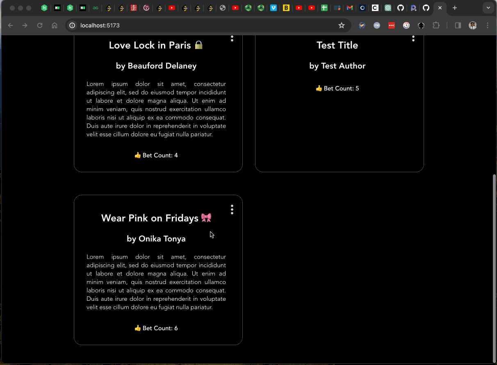

# Web Development Project 7 - Bet App

Submitted by: **Kev**

This web app is designed for Gen Z thrill-seekers where users can post challenges and other users can accept these challenges by clicking the “Bet” button. It incorporates all four CRUD operations allowing users to create, read, update, and delete challenges. Additionally, it tracks the number of bets on each challenge and updates these in real-time.

Time spent: **4 hours 45 minutes** spent in total

## Required Features

The following **required** functionality is completed:

- [x] **A create form allows users to submit new challenges.**
- [x] **All submitted challenges can be read on the homepage.**
- [x] **A challenge can be updated once it has been submitted.**
- [x] **A challenge can be deleted once it has been submitted.**

## Stretch Features

The following **stretch** features are implemented:

- [x] **The app keeps track of the bet count for each challenge and updates this count in the database when the Bet button is clicked.**
- [x] **The site displays the total number of users who have accepted each challenge.**

## Additional Features

* [ ] List anything else that you added to improve the site's functionality!

## Video Walkthrough

Here's a walkthrough of implemented user stories:

<!-- Replace this with whatever GIF tool you used! -->
GIF created with [Kap](https://getkap.co/) for macOS.

## Notes

One of the main challenges encountered was ensuring the bet count updated correctly on rapid user interactions. This required careful management of state and database transactions to ensure data integrity and responsiveness.

## License

    Copyright [2023] [Kev]

    Licensed under the Apache License, Version 2.0 (the "License");
    you may not use this file except in compliance with the License.
    You may obtain a copy of the License at

        http://www.apache.org/licenses/LICENSE-2.0

    Unless required by applicable law or agreed to in writing, software
    distributed under the License is distributed on an "AS IS" BASIS,
    WITHOUT WARRANTIES OR CONDITIONS OF ANY KIND, either express or implied.
    See the License for the specific language governing permissions and
    limitations under the License.
